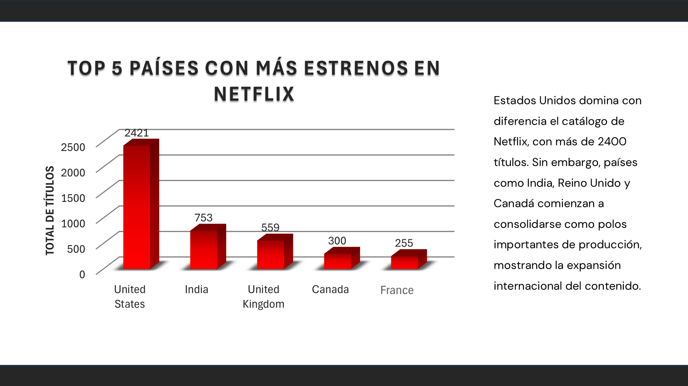
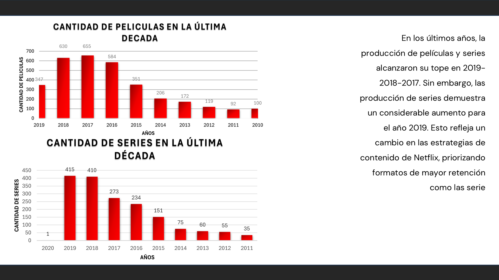
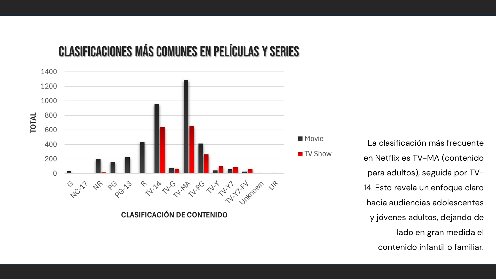
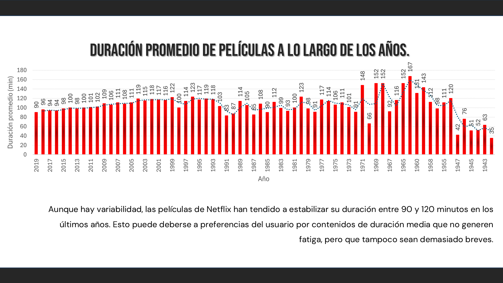
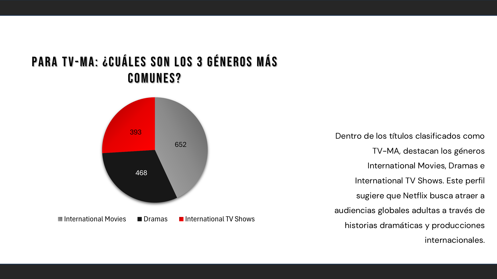

# 🎬 Análisis del Catálogo de Netflix con SQL y Excel

## 📌 Objetivo del Proyecto

El objetivo de este proyecto fue analizar el catálogo de títulos de Netflix mediante consultas SQL, para explorar información relacionada con países, géneros, clasificaciones, duraciones y tendencias. Además, se generaron visualizaciones en Excel que permiten interpretar patrones en la producción y distribución de contenidos a nivel global.

---

## 🗂️ Estructura de la Base de Datos

Se trabajó con una base de datos relacional compuesta por las siguientes tablas:

- `shows`: información principal de cada título.
- `showtype`: tipo de contenido (película o serie).
- `rating`: clasificación por edad (TV-14, PG, R, etc.).
- `genre`: géneros asociados (Drama, Comedia, etc.).
- `country`: país de producción.
- `show_genre`: relación muchos a muchos entre shows y géneros.
- `show_country`: relación muchos a muchos entre shows y países.

---

## 🧠 Consultas Realizadas

### 🔹 Parte 1 – Conociendo la Data
1. Total de títulos en el catálogo  
2. Tipos de contenido registrados  
3. Número de países representados  
4. Clasificaciones de edad existentes  

### 🔹 Parte 2 – Análisis en Profundidad
5. País con mayor cantidad de títulos  
6. Los 5 géneros más frecuentes  
7. Clasificación más común en películas y series  
8. Evolución de duración promedio de películas por año  
9. País con mayor diversidad de géneros  
10. Título más antiguo en la plataforma  

### 🔹 Parte 3 – Pregunta Propia
1. Para la clasificación de edad 'TV-MA' ¿cuáles son los 3 géneros más comunes?
2. ¿Cuántas TV Show por año se estrenaron durante los utlimos 15 años de menor a mayor?
3. ¿Cuáles son los 5 países con más títulos en el catálogo?
4. Cual es el año con mayor cantidad de titulos agregados al catalogo
5. Cuáles con las 5 series con mayor número de Temporadas en Netflix y su año de Lanzamiento?

---

## 📊 Visualizaciones

Se crearon gráficos en Excel a partir de los resultados de las consultas. Algunas de las visualizaciones incluidas son:

- Top 5 países con más estrenos.
- Comparativa de clasificaciones por edad entre películas y series.
- Evolución anual de duración promedio de películas.
- Gráfico de crecimiento por tipo de contenido (películas vs series).
- Gráfico de géneros más comunes en contenido clasificado como TV-MA.

  
  
  
  
  

---

## 💡 Principales Insights

- Estados Unidos sigue siendo el país con más estrenos en Netflix, pero India y Reino Unido han ganado protagonismo.
- El contenido más producido se dirige a adolescentes y adultos jóvenes, con predominancia de clasificaciones como TV-MA y TV-14.
- La duración promedio de películas se ha mantenido entre 90 y 120 minutos, alineándose con las preferencias de consumo actuales.
- En la última década, las **series** han mostrado un crecimiento sostenido, mientras que las películas tienden a estabilizarse o disminuir.

---

## 🛠️ Herramientas Utilizadas

- MySQL
- Microsoft Excel
- PowerPoint (para presentación)
- GitHub (para documentación y publicación)

---

## 👩‍💻 Autores

- CALI LOPES ENIER ALDOZARI
- CHUSAN ZAMBRANO CAMILA JOHANA
- MUÑOZ MINA IVETTE STEPHANIE
- OBREGÓN FLORES ALEXIS WLADIMIR
- RIOFRIO CELI MARLON DAVID
